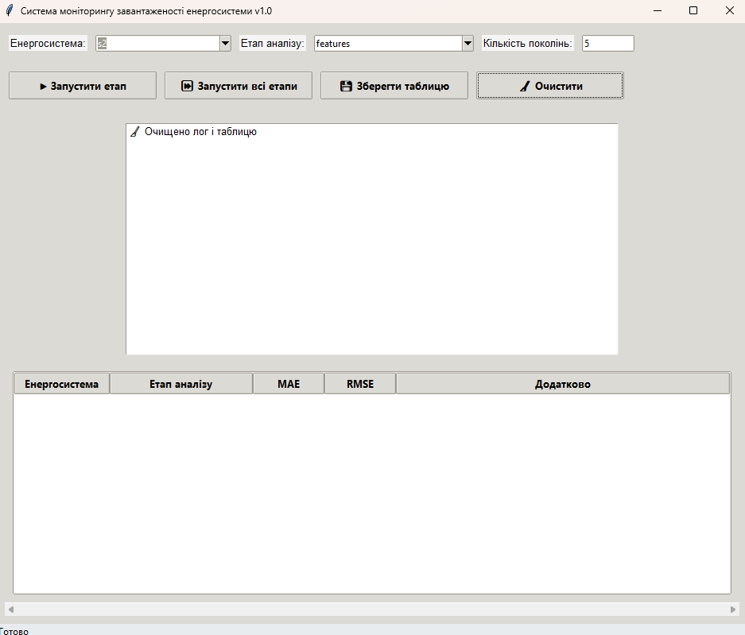

# Neuro-energy: еволюційний синтез нейромережевих моделей

Програма виконує еволюційний пошук для побудови нейромережевих моделей прогнозу навантаження енергосистеми. Реалізовано чотири етапи:
- Відбір інформативних ознак
- Параметричний синтез
- Структурний синтез
- Оптимізація структури (Парето-фронт)

Проведено тестування на різних вибірках даних, результати порівняльного аналізу зводяться до таблиці з чіткою системою критеріїв.

---

## Встановлення та запуск

- **Вимоги:** Python 3.10+ (Tkinter входить до стандартної бібліотеки)
- **Залежності:**  у requirements.txt
#### Кроки інсталяції
1. Клонувати репозиторій
   - git clone https://github.com/Lutvunenko-Dmutro/neuro-energy.git
   - cd neuro-energy
2. Встановити залежності
   - pip install -r requirements.txt
3. Підготувати дані CSV у папці data/ згідно static/mappings.py
4. Запустити інтерфейс
   - python gui.py

---

## Структура проєкту

- datasets.py — завантаження даних X, y, cols з CSV (останній стовпчик — ціль y)
- gui.py — графічний інтерфейс (Tkinter + ttk)
- gui_handlers.py — логіка запуску етапів, логування, таблиця, експорт
- static/mappings.py — шляхи до датасетів і «людяні» назви
- static/mode_config.py — мапінг режимів на функції відповідних GA
- ga_load_features.py — GA для відбору ознак
- ga_model_params.py — GA для параметричного синтезу (hidden, lr, alpha)
- ga_network_structure.py — GA для структурного синтезу (шари × нейрони)
- ga_multiobjective_opt.py — GA для Парето-оптимізації (MAE, RMSE)

---

## Режими та критерії порівняння

#### Режими (в GUI: поле «Етап аналізу»)
- Відбір ознак: мінімізує MAE при виборі підмножини ознак; додатково показує кількість обраних ознак
- Параметри: оптимізація hidden, lr, alpha із крос-валідацією TimeSeriesSplit
- Структура: оптимізація layers × neurons для MLPRegressor
- Оптимізація структури: багатокритеріальна Парето-оптимізація за MAE і RMSE

#### Система критеріїв для таблиці порівнянь
- Основні метрики: MAE (середня абсолютна похибка), RMSE (квадратична похибка)
- Додаткові (за етапами):
  - Відбір ознак: std(MAE) на CV-сплітах, кількість відібраних ознак
  - Параметри: h, lr, alpha (конфігурація моделі)
  - Структура: layers × neurons (архітектура)
  - Парето: множина рішень, кожне як layers × neurons із MAE, RMSE

> Для багатокритеріальної оптимізації домінування визначається за правилом Парето (краще або рівне за обома метриками і строго краще за однією).

---

## Робота з даними

- Файл static/mappings.py визначає шляхи до CSV:
  - s1 → data/s1_hourly.csv
  - s2 → data/s2_daily.csv
  - s3 → data/s3_hourly_vre.csv
  - s4 → data/s4_shift.csv
- Остання колонка у CSV — ціль (навантаження), решта — ознаки.
- Читання даних: datasets.load_dataset(key) повертає (X, y, cols).

---

## Інтерфейс та результати

- Панель вибору:
  - Енергосистема (s1–s4)
  - Етап аналізу (features/params/structure/opt)
  - Кількість поколінь n_gen
- Кнопки:
  - «Запустити етап» — запуск обраного режиму
  - «Запустити всі етапи» — послідовний запуск features → params → structure → opt
  - «Зберегти таблицю» — експорт у CSV
  - «Очистити» — очищення логу і таблиці

#### Експорт
- Таблиця з результатами експортується у results/summary.csv.
- Формат колонок: Енергосистема | Етап аналізу | MAE | RMSE | Додатково.

#### Приклад рядків у таблиці
| Енергосистема | Етап аналізу                | MAE   | RMSE  | Додатково                      |
|---------------|-----------------------------|-------|-------|--------------------------------|
| s1            | Відбір ознак                | 0.412 | 0.538 | Ознаки: temp, wind, holiday   |
| s1            | Параметричний синтез        | 0.395 | 0.521 | h=64, lr=0.01, α=0.001        |
| s1            | Структурний синтез          | 0.382 | 0.507 | 2×64                           |
| s1            | Оптимізація структури       | 0.380 | 0.505 | 2×64 (Парето‑рішення=5)       |

Фото програми

---

## Примітки щодо відтворюваності та швидкодії

- Використовується TimeSeriesSplit із налаштовуваною кількістю сплітів (cv_splits).
- Для стабільності встановлені random_state в моделях і генераторах.
- Параметри GA (pop_size, mutation_rate, n_gen) можна адаптувати під цілі:
  - Для швидкої демонстрації на невеликих вибірках — зменшити n_gen і pop_size
  - Для глибокого аналізу й кращого покриття простору рішень — збільшити n_gen і pop_size

